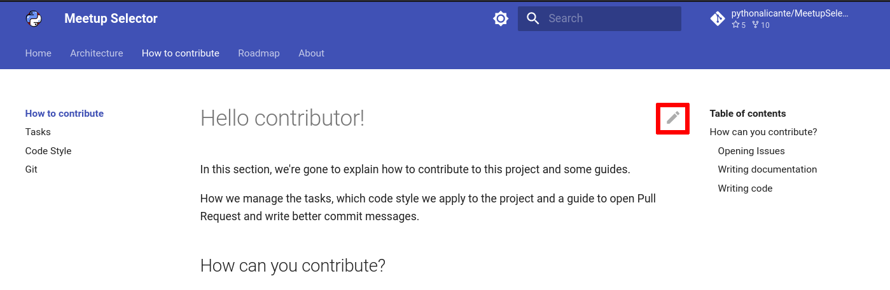

# Hello contributor!

In this section, we're gone to explain how to contribute to this project and some guides.

How we manage the tasks, which code style we apply to the project and a guide to open Pull Request and write better commit messages.

## How can you contribute?

There are many ways to contribute to an Open Source project, as:

* Testing the project and opening Issues.
* Writing documentation.
* Collaborate writing code for the project.
* Making videos, tutorials, etc. of how to use this project.
* Do Talks to show the project to other people.
* And a lot of things more...

### Opening Issues

### Writing documentation

Feel free to open a Pull Request with the changes that you consider using the `Edit` button in the page you want to change and we review it.

### Writing code

