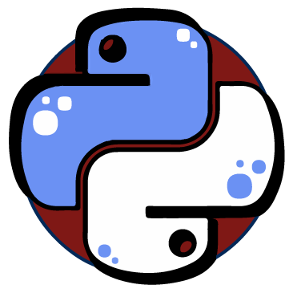

---
hide:
  - footer
  - toc
  - navigation
---

# Welcome to Meetup Selector.

The aim of this project is to provide to communities a way to select the topic for the next Meetup.

It also provides a "Landing Page", Talks, Speakers and more things to make the management of a community easiest.

> This documentation is in progress.

